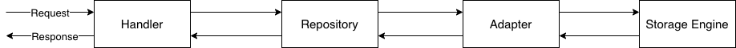

# Organization's Relations Service
A RESTful service that enables users to create and retrieve the relations of an organization.  
The possible relations an organization can have are `PARENT`, `DAUGHTER`, `SISTER`.  

## Table of Contents
[Getting Started](./README.md#getting-started)
  * [Requirements](./README.md#requirements)
  * [Installing](./README.md#installing)
  * [Running](./README.md#running)
  * [Testing](./README.md#testing)  

[Endpoints](./README.md#endpoints)
  * [POST `/organization/relations`](./README.md#post-organizationrelations)
  * [GET `/organization/:name/relations`](./README.md#get-organizationnamerelations)

[DB Schema](./README.md#db-schema)
  * [The Indices](./README.md#the-indices)

[Architecture](./README.md#architecture)
  * [Handlers](./README.md#handlers)
  * [Repository](./README.md#repository)
  * [Adapters](./README.md#adapters)

[Benchmarks](./README.md#benchmarks)
  * [Inserting](./README.md#inserting)
  * [Fetching](./README.md#fetching)

## Getting Started
### Requirements
  * NodeJS version 14 or higher  
### Installing
```npm install```
### Running
```
npm start
```
### Testing
```
npm test
```
Alternatively, you can run the tests in watch mode with:
```
npm run test:watch
```

## Endpoints
### POST `/organization/relations`
Creates the relations of an organization.  
#### Request Body
```json
{
  "org_name": "<parent>",
  "daughters": [
    {
      "org_name": "<child 1>",
      "daughters": [
        {
          "org_name": "<child 1.1>",
          "daughters": [...]
        }
      ]
    },
    {
      "org_name": "<child 2>",
      "daughters": [...]
    },
    ...
  ]
}
```
#### Success Response
```json
{
  "success": true
}
```

#### Error Response by omission of `org_name`
A HTTP response with status 400 (BAD REQUEST) and the body:
```json
{
  "message": "Property 'org_name' must be present"
}
```

#### Error Response by omission of `daughters`
A HTTP response with status 400 (BAD REQUEST) and the body:
```json
{
  "message": "Organization '<org_name>' must have daughters"
}
```

#### Error Response by server failure
A HTTP response with status 500 (Internal Server Error) and the body:
```json
{
  "message": "<message>"
}
```

### GET `organization/:name/relations`
Retrieves the relations of the organization `:name`.  
The relations are sorted alphabetically and paginated with a maximum of 100 relations by page.  
#### Success Response
```json
{
  "relations": [
    {
      "org_name": "Child 1",
      "relationshio_type": "daughter"
    },
    {
      "org_name": "Child 2",
      "relationshio_type": "sister"
    },
    {
      "org_name": "Parent",
      "relationshio_type": "parent"
    }
  ],
  "pagination": {
    "prev_cursor": "Child 1",
    "next_cursor": "Parent"
  }
}
```
#### Query Parameters
This endpoint takes three query parameters: `limit`, which specifies the maximum number of results, and `before` and `after` which are used to navigate through the pages of results.  
The `limit` has a default value of 100.  

#### Pagination
This endpoint supports cursor based pagination, which means clients can only request the *previous* and *next* page and not a specific page.  
The server responds with a `pagination` property that contains the name of the first relation, in `prev_cursor`, and the name of the last relation, in `next_cursor`.  
The value of `next_cursor` will be `null` when there are no more pages.  
Clients move between pages by sending either the query parameter: `before` **OR** `after`, depending if they want the previous or next page respectively.  
Both parameters are exclusive, which means their values won't appear on the result set.

##### Example
##### First Page
`GET organization/:name/relations`
###### Next Page
To fetch the next page, the client sends `next_cursor` as the `after` query parameter value.  
`GET /organization/:name/relations?after=<next_cursor>`.  
###### Previous Page
To fetch the previous page sends `previous_cursor` as the `before` query parameter value.
`GET /organization/:name/relations?before=<prev_cursor>`.

## DB Schema
  

The service is supported by a `relations` table and a `relations_desc` table, with each one having an associated index.  
Each row of `relations` can be seen as an edge of a graph where the column `head` represents the start vertice, the column `tail` represents the end vertice, and the column `type` representing the type of relationship.  

### The indices
Since retrieving relations by alphabetical order needs to be supported, two indices were created, one on the `relations` and the other on `relations_desc` table.  
The indices are schematically the same, where the `head` column acts as the "primary key" and the `tail` column acts as the "sort key". The only difference is that one index is in ascending order and the other is in descending order.  
This can be seen as an `ORDER BY` done at insertion time instead of query time.    

**Example**  
The relations table could be in this state and no order would be guaranteed if we retrieved the rows.  

  

However, the indices would be like this, guaranteeing both ascending and desceding alphabetical order.  


## Architecture
This project follows the current code architecure:  



### Handlers
Handlers are the first and last point of contact with the client, they are responsible for validating the client's request and responding adequately.  
Handlers only interact with the repository.

### Repository
Repository provide the access paterns for our usecases.  
It uses an *adapter* to interact with the storage layer.  
The repository must fulfill this contract:
```ts
interface {
  /**
   * @param relations - an array of relations objects { head: string, tail: string, type: string }
   * 
   * @returns boolean - indication of success
   * 
   * @throws Error - a JS Error object
   */  
  batchInsert(relations: array): boolean;

  /**
   * @param request - an object like { name: string, before: string, after: string, limit: int }
   * 
   * @returns array - an array of objects { items: array, exclusivePrevKey: string, exclusiveStartKey: string }  
   * 
   * @throws Error - a JS Error object
   */ 
  findByOrganization(request: object): array;
}
```

### Adapters
An adapter is an abstraction layer over the actual storage used be it SQL, NoSQL or even in-memory.  
An adapter must fulfill this contract:  
```ts
interface {
  /**
   * This operation MUST be atomic, meaning if one insert fails all the others are rolled back.
   * 
   * @param records - an array of record objects { head: string, tail: string, type: string }
   * 
   * @returns boolean - indication of success
   * 
   * @throws Error - a JS Error object
   */  
  batchInsert(records: array): boolean;

  /**
   * @param request - an object like { name: string, before: string, after: string, limit: int }
   * 
   * @returns array - an array of records
   * 
   * @throws Error - a JS Error object
   */ 
  queryByNamePaginated(request: object): array;
}
```

## Benchmarks
### Inserting (in-memory DB)
| 10  | 100  | 1000 | 10000 | 100000 | 1000000 |
| :-: | :--: | :--: | :---: | :----: | :-----: |
| 3ms | 24ms | 69ms | 695ms | 6s     | 57s     |
