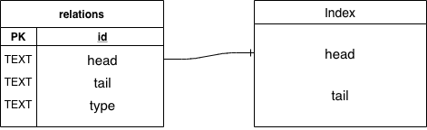

# Organization's Relations Service
A RESTful service that enables users to create and retrieve the relations of an organization.  
The possible relations an organization can have are `PARENT`, `DAUGHTER`, `SISTER`.  

## Getting Started
### Requirements
  * NodeJS version 14 or higher  
### Installing
```npm install```
### Running
```
npm start
```
### Tests
```
npm test
```
Alternatively, you can run the tests in watch mode with:
```
npm run test:watch
```

## Endpoints
### POST `/organization/relations`
Create the relations of an organization.  
It expects a body in JSON format with the schema
```json
{
  "org_name": "<parent>",
  "daughters": [
    {
      "org_name": "<child 1>",
      "daughters": [
        {
          "org_name": "<child 1.1>",
          "daughters": [...]
        }
      ]
    },
    {
      "org_name": "<child 2>",
      "daughters": [...]
    },
    ...
  ]
}
```
A succesful response
```json
{
  "success": true
}
```
More information [LINK](LINK)

### GET `organization/:name/relations`
Retrieve the relations of the organization `:name`.  
The relations are sorted alphabetically and capped at a maximum of 100 relations with support for pagination.  
An example of a succesful response.
```json
{
  "relations": [
    {
      "org_name": "Child 1",
      "relationshio_type": "daughter"
    },
    {
      "org_name": "Child 2",
      "relationshio_type": "sister"
    },
    {
      "org_name": "Parent",
      "relationshio_type": "parent"
    }
  ],
  "pagination": {
    "prev_cursor": null,
    "next_cursor": "Parent"
  }
}
```
More information [LINK](LINK)

## DB Schema
  

The service is supported by a `relations` table and an associated index.  
Each row of `relations` can be seen as an edge of a graph where the column `head` represents the start vertice, the column `tail` represents the end vertice, and the column `type` representing the type of relationship.  
### The index
Since retrieving relations by alphabetical order needs to be supported, an index was created on the `relations` table where the `head` column acts as the "primary key" and the `tail` column acts as the "sort key".  This can be seen as an `ORDER BY` done at insertion time instead of query time.  

**Example**  
The relations table could be in this state and no order would be guaranteed.  
  
However, the index would be like this, guaranteeing the alphabetical order.  

